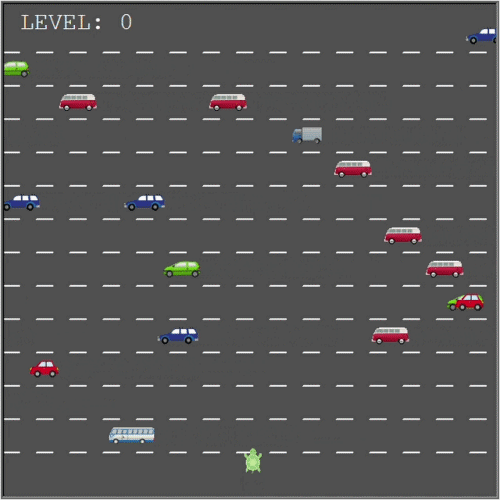
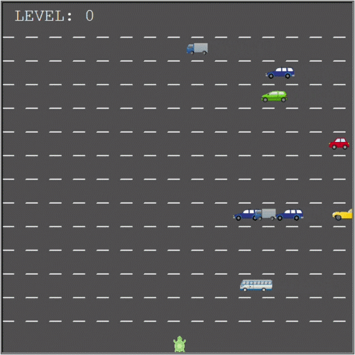

## Day 23 - Capstone Project

---

### 📌 Project Overview

Building the **Turtle Crossing Game** using the turtle module.  

The player must safely cross the road while avoiding moving cars.  
Each successful crossing increases the game difficulty.

The game ends when the turtle collides with a car or when all levels are completed.

---

### 🛠️ Features

- Player movement with keyboard controls
- Randomly generated moving cars
- Collision detection system
- Increasing difficulty by level
- Scoreboard and level tracking
- Game over screen

---
### ✨ Added Features
- Final level completion message (ALL LEVELS COMPLETE)
- Car sprites using multiple .gif images with random selection
- Player character replaced with custom player_turtle.gif
- Event-based fast cars (some cars move slightly faster than others)
- Road lane design with visual separation lines between lanes
- Cars are constrained to lane-based movement for structured traffic flow

---

### 📝 Tasks

1. Create a turtle object 
2. Generate multiple cars dynamically
3. Move cars across the screen
4. Detect collisions with cars
5. Detect when the player reaches the finish line
6. Increase car speed after each level
7. Display level information and game over message

---

## 🎮 Controls & Demo

- Move Forward: `Up`
- Move Left: `Left`
- Move Right: `Right`




---

## 🧠 Notes


### Using Predefined Shapes (.gif images)
- The turtle module allows custom images to be used as shapes instead of default shapes like "circle" or "square".

- Registering a custom shape:
    - Before using an image, it must be registered with the screen.
    ```python
    screen.register_shape("red_car.gif")
    ```
    - This tells turtle to recognize the .gif file as a valid shape.

- Assigning a shape to a turtle:
    - We can set the shape when creating or updating a turtle.
    ```python
    car.shape("red_car.gif")
    ```
    - This replaces the default turtle appearance with an images.
  
- Only `.gif` format is supported in the turtle module.