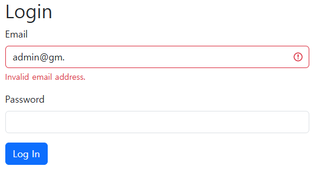

# Day 61 - Flask & WTForms: Advanced Forms

---

## 📌 Overview
Built a protected Flask website using Flask-WTF and WTHorms.  
Created a login form that checks a user's username and password before allowing access to a secret page.  
Also used Bootstrap-Flask and Jinja2 template inheritance to create reusable and styled templates.  


---

## 📝 Tasks

* Set up Flask-WTF and WTForms
* Create a LoginForm using WTForms
* Add email and password fields
* Add form validation using DataRequired, Email, and Length
* Add CSRF protection
* Handle GET and POST requests
* Use validate_on_submit() to check submitted forms
* Check login credentials
* Display a success page for valid credentials
* Display a denied page for invalid credentials
* Use Bootstrap-Flask for styling
* Use Jinja2 template inheritance with base.html
* Render WTForms using Bootstrap's render_form()

---

## 🧠 Notes

### Flask-WTF and WTForms
Flask-WTF integrates WTForms with Flask and makes it easier to create and validate forms.  

Instead of manually creating every form field in HTML, form fields can be defined in Python. 
```python
from flask_wtf import FlaskForm
from wtforms import StringField, PasswordField, SubmitField
from wtforms.validators import DataRequired, Email, Length

class LoginForm(FlaskForm):
    email = StringField( # text input
        "Email",
        validators = [DataRequired(), Email()] # checks that the input has a valid email format.
    ) # DataRequired(): checks that the field is not empty.
    password = PasswordField( # password input
        "Password",
        validators = [DataRequired(), Length(min=8)] # requires at least 8 characters.
    )
    submit = SubmitField("Log In") # submit button
```
This creates the form fields and allows WTForms to habdle vaalidation.  
*WTForms* provides different field types for different kinds of input.  
*Validators* check whether submitted form data meets certain requirements.

### CSRF Protection
Flask-WTF provides CSRF protection for forms.  
When rendering a form manually, the CSRF token can be included with:  
```html
{{ form.scrf_token }}
```
The CSRF token helps protect forms from Cross-Site Request Forgery attacks.  
`validate_on_submit()` checks whether the form was submitted with a `POST` request and whether the submitted data passes validation.
```python
@app.route("/login", methods=["GET", "POST"])
def login():
    form = LoginForm()
    if form.validate_on_submit():
        email = form.email.data
        password = form.password.data
        if form.email.data == "admin@email.com" and form.password.data == "password":
            return render_template("success.html")
        else:
            return render_template("denied.html")
    return render_template("login.html", form=form)
```
Submitted values can be accessed using the `.data` attribute.  
The values can then be used to check login credentials.  

### Jinja2 Template Inheritance
Jinja2 allows templates to inherit a commen layout.  
A base template can contain shared HTML structure:
```html


```
A child template can inherit the base template:
```html


Login


    <h1>Login</h1>

```
This avoids repeating the same HTML structure across multiple pages.

`{{ super() }}` keeps the content from the parent block while allowing the child template to add more content.
```html

    {{ super() }}
    <p>Additional content</p>

```

### Bootstrap-Flask
Bootstrap-Flask intefrates Bootstrap with Flask and can be used to style WTHorms.
```python
from flask_bootstrap import Bootstrap5

bootstrap = Bootstrap5(app)
```

Bootstrap-Flask can render a WTForms form automatically.

```html

{{ render_form(form) }}
```
This avoids manually creating the labels, input fields, validation messages, CSRF token, and submit button.  

`render_form()` renders a WTForms form using Bootstrap styling.
```html


Login

    <div class="container">
        <h1>Login</h1>
        {{ render_form(form) }}
    </div>

```
The Flask route passes the form to the template:
```python
return render_template("login.html", form=form)
```
The template can then use `{{ render_form(form) }}` to display the complete form.

