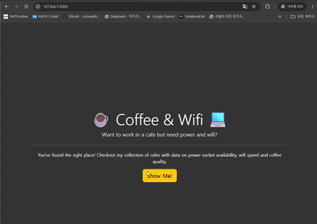

# Day 62 - Cafe WIFI Project

---

## 📌 Overview
Built a Flask website for adding and displaying cafe information.  
Used Flask-WTF to create and validate forms, Flask-Bootstrap to style the application, and Bootstrap classes to create a responsive layout.  
Also practiced reading from and writing to CSV files to store and update cafe data.

---

## 📝 Tasks

* Apply custom CSS styling to the home page
* Add navigation between the home page and cafe list
* Create a cafe form at `/add`
* Validate and submit cafe information
* Save new cafe data to the CSV file
* Display the updated cafe list after submission
* Add clickable Google Maps links
* Add URL validation for the location field

---

## 🧠 Note

### URL Validation
The `URL()` validator can be used to check whether a submitted value has a valid URL format.

```python
from wtforms.validators import DataRequired, URL

location = StringField(
    "Cafe location on Google Maps (URL)",
    validators=[DataRequired(), URL()]
)
```
`DataRequired()` checks that the field contains a value, while `URL()` checks the URL format.


### SelectField
`SelectField` can be used to create a dropdown menu with predefined choices.

```python
from wtforms import SelectField

coffee = SelectField(
    "Coffee Rating",
    choices=[
        ("☕️", "☕️"),
        ("☕️☕️", "☕️☕️"),
        ("☕️☕️☕️", "☕️☕️☕️"),
        ("☕️☕️☕️☕️", "☕️☕️☕️☕️"),
        ("☕️☕️☕️☕️☕️", "☕️☕️☕️☕️☕️")
    ],
    validators=[DataRequired()]
)
```
The first value is the value submitted by the form, and the second value is displayed to the user.


### Placeholder Text
render_kw can be used to add HTML attributes to a WTForms field.
```python
open = StringField(
    "Opening Time",
    render_kw={"placeholder": "8AM"},
    validators=[DataRequired()]
)
```
This displays 8AM as a light placeholder inside the input field.


### Rendering CSV Data with Jinja
The CSV rows can be displayed using nested for loops.
```html

    <tr>
        
            <td>{{ item }}</td>
        
    </tr>

```
The outer loop goes through each row, while the inner loop goes through each item in the row.


### Rendering URLs as Links
Google Maps URLs can be detected by checking the first four characters of the value.
```html

    <td>
        <a href="{{ item }}" target="_blank">Maps Link</a>
    </td>

    <td>{{ item }}</td>

```
Instead of displaying the full URL, the table displays Maps Link.  
The actual URL is used as the href value.

