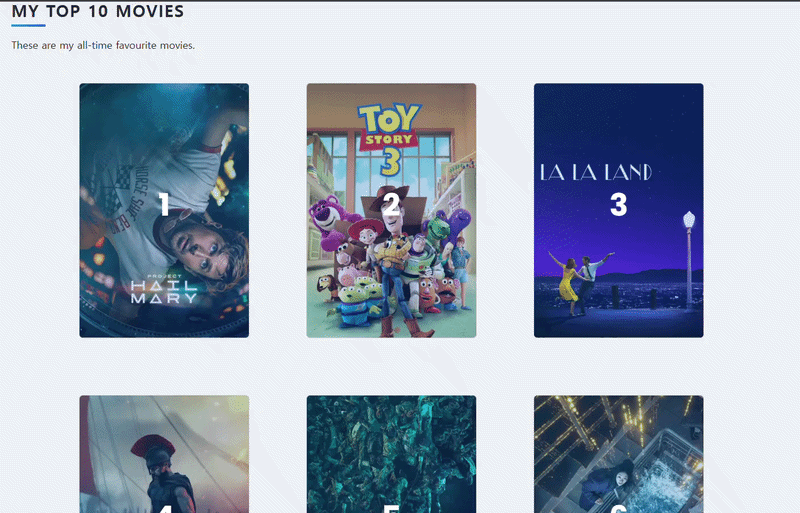
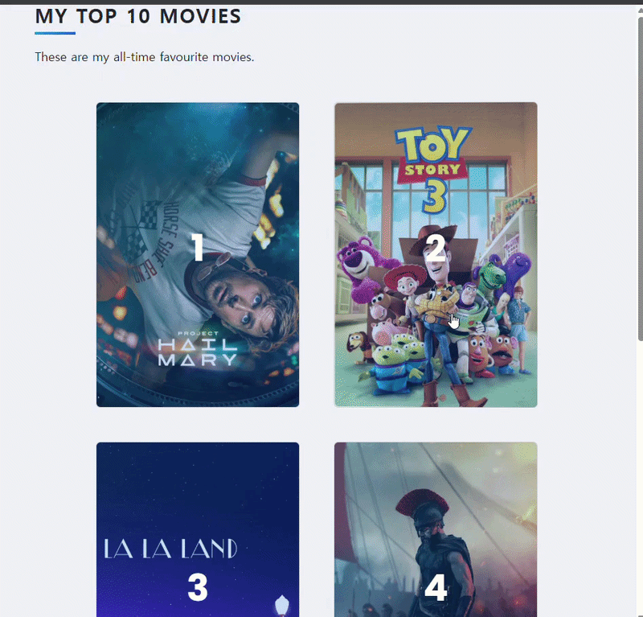

# Day 64 - Best Movies Top 10 Project

---

## 📌 Overview

A Flask web application for creating and managing a personal Top 10 Movies list.  
Users can search for movies using The Movie Database (TMDB) API, add movies to their personal list, rate and review them, and automatically rank movies based on their ratings.
Built with Flask, Flask-WTF, Flask-Bootstrap, SQLite, and SQLAlchemy.





---

## 📝 Tasks

* Create a Flask application and set up an SQLite database using SQLAlchemy
* Search for movies using the TMDB API and display the search results
* Select a movie from the search results and add it to the database
* Add, edit, and delete personal ratings and review for movies
* Sort movies by my personal ratings and automatically assign rankings based on the ratings

---

## 🧠 Note

### Passing Data to Templates
Data can be passed from Flask to a Jinja template using `render_template()`.
```python
return render_template("select.html", movies=data["results"])
```
The data can then be accessed in the template:
```html

    {{ movie.title }}
    {{ movie.release_date }}

```


### Flask-WTF Forms
Flask_WTF can be used to create and validate forms.
```python
class RateMovieForm(FlaskForm):
    rating = StringField("Your Rating Out of 10 e.g. 7.5")
    review = StringField("Your Review")
    submit = SubmitField("Done")
```
The form can then be rendered in a Jinja template:
```html
<form method="POST">
    {{ form.hidden_tag() }}

    {{ form.rating.label }}
    {{ form.rating() }}

    {{ form.review.label }}
    {{ form.review() }}

    {{ form.submit() }}
</form>
```
`hidden_tag()` includes the CSRF token required for Flask-WTF forms.