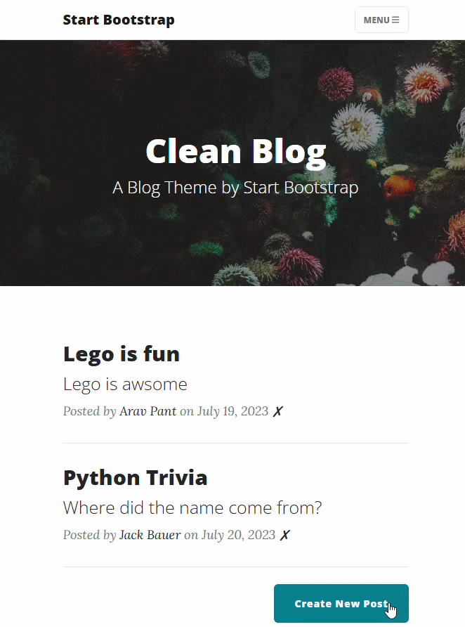
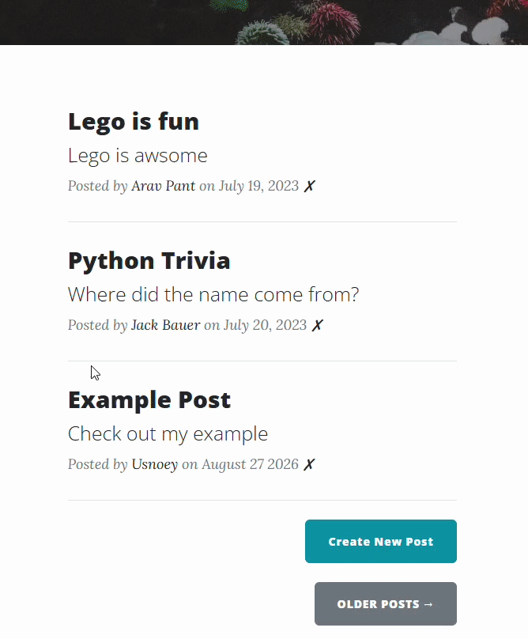
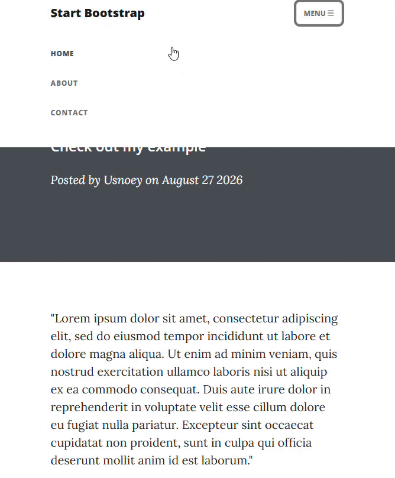

# Day 67 - Building a RESTful Blog

---

## 📌 Overview
Build a RESTful blog application by adding mutiple HTTP routes for creating, editing, and deleting blog posts.  
The project focuses on using Flask routes and HTTP methods to manage blog posts and build a RESTful web application.

---

## 🎬 Demo

### Add Post


### Edit Post


### Delete Post


---

## 📝 Tasks

* Build a RESTful blog using Flask
* Add routes for creating, editing, and deleting posts
* Use HTTP methods to handle different CRUD operations
* Connect blog posts to a database
* Use dynamic URL parameters to identify posts
* Redirect users after form submissions

---

## 🧠 Note

### BlogPostForm(obj=post)
```
form = BlogPostForm(obj=post)
```
If you pass an existing BlogPost object to the `obj` property of the form, the data is automatically populated into the WTForm fields.

### CKEditor
CKEditor is a rich text editor that allows users to create and format content using a visual editor.  

In Flask, Flask-CKEditor can be used with WTForms to turn a form field into a CKEditor field.
```python
from flask_ckeditor import CKEditor, CKEditorField

ckeditor = CKEditor(app)

class BlogPostForm(FlaskForm):
    body = CKEditorField("Blog Content", validators=[DataRequired()])
```
The `CKEditorField` allows users to format blog content with features such as headings, bold text, lists, links, and images.  

In the template, CKEditor can be loaded with:
```html
{{ ckeditor.load() }}
```
The submitted content can then be accessed through the WTForm like a regular field:
```python
form.body.data
```
Since CKEditor generates HTML content, the blog post body can be rendered using Jinja's `safe` filter:
```html
{{ post.body|safe }}
```
This allows the HTML formatting created in CKEditor to be displayed correctly on the blog post page.