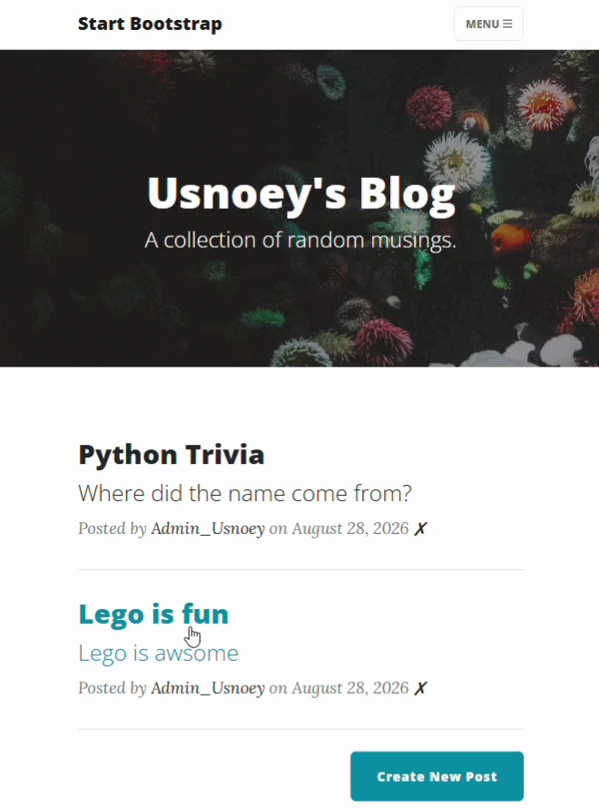
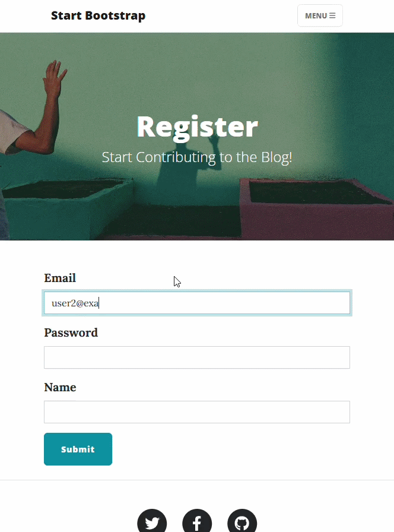

# Day 69 - Add Users to the Blog

---

## 📌 Overview
Add user authentication to the blog so users can register, log in, and leave comments on blog posts.  
Complete the blog by making it ready for real users.

---

## 🎬 Demo

### Admin Login


### User Login


---

## 📝 Tasks

* Add user registration and login.
* Hash user passwords securely using Werkzeug.
* Add authentication to the blog using Flask-Login.
* Restrict admin features to the first registered user.
* Allow authenticated users to comment on blog posts.
* Display comments and comment authors.
* Add Gravatar images for comment authors.
* Create relationships between Users, BlogPosts, and Comments.
* Protect admin-only routes with a custom `@admin_only` decorator.
* Display Login/Register or Log Out depending on authentication status.


---

## 🧠 Note

### Database Relationships
The project uses SQLAlchemy relationships to connect users, blog posts, and comments.

The relationship structure is:
```text
User
 ├── posts
 │     ├── BlogPost
 │     └── BlogPost
 │
 └── comments
       ├── Comment
       └── Comment


BlogPost
 ├── author → User
 └── comments
       ├── Comment
       └── Comment


Comment
 ├── author → User
 └── parent_post → BlogPost
```
This creates two one-to-many relationships:
```text
User → BlogPost
User → Comment
BlogPost → Comment
```
For example:
```text
posts = relationship(back_populates="author")
```
and:
```text
author = relationship(back_populates="posts")
```
allow the relationship to work in both directions.

### Admin User
The first registered user has:
```text
id = 1
```
and is treated as the blog administrator.  

Only the administrator can:
- Create new posts
- Edit posts
- Delete posts
The routes are protected using a custom decorator such as:
```python
@admin_only
```
If a user who is not the administrator attempts to access an admin-only route, Flask returns:
```python
abort(403)
```

### Comments
Authenticated users can leave comments on blog posts.  

Comments are stored in the database and connected to both:
```text
User
BlogPost
```
A comment therefore knows:
```text
comment.author
comment.parent_post
```
A blog post can access all of its comments through:
```text
post.comments
```

### Gravatar
Comment authors can display their Gravatar image using their registered email address:
```html

```
Flask-Gravatar provides the gravatar Jinja filter.